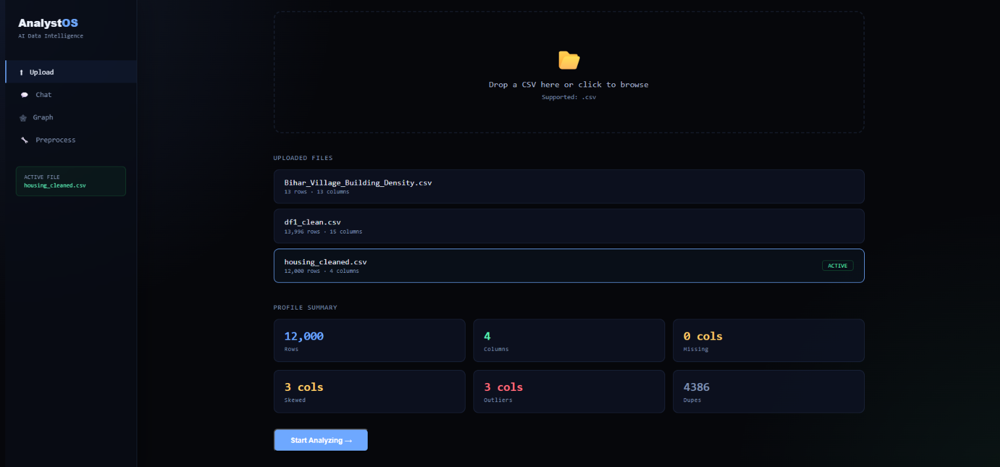
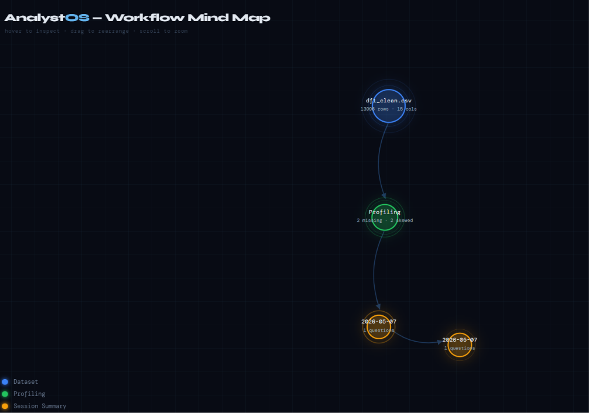

# AnalystOS 

AI-powered analytical workspace for natural language dataset exploration, semantic retrieval, and agentic preprocessing workflows.

---

## Features

- Natural language interaction with datasets
- RAG-based analytical querying
- Semantic retrieval using SentenceTransformers + FAISS
- Workflow-aware contextual memory
- LLM-guided preprocessing pipelines
- FastAPI backend + React frontend

---

## Architecture

```text
User Query
   ↓
Semantic Retrieval (FAISS)
   ↓
Workflow Context Retrieval
   ↓
Gemini Reasoning Layer
   ↓
Insights / Preprocessing Actions
```

---

## Tech Stack

### Backend
- FastAPI
- Python
- Pandas
- SentenceTransformers
- FAISS
- NetworkX

### Frontend
- React.js
- Tailwind CSS

### AI Components
- Gemini API
- RAG Pipelines
- Semantic Search

---

## Core Components

- Semantic retrieval using SentenceTransformers + FAISS
- Graph-based workflow memory and contextual state tracking
- LLM-guided preprocessing pipelines
- Context-grounded analytical querying using RAG

---


## Installation

### Clone Repository

```bash
git clone https://github.com/Zoheen0610/analystos
```

### Backend

```bash
cd backend
pip install -r requirements.txt
uvicorn main:app --reload
```

### Frontend

```bash
cd frontend
npm install
npm run dev
```

---

## Future Improvements

- Multi-agent workflows
- Persistent vector databases
- LangGraph integration
- Automated visualization generation

---

**Zoheen Shahzad**  
Jamia Millia Islamia
